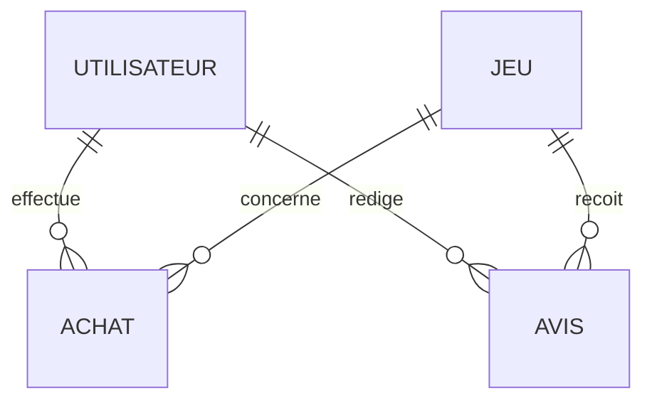
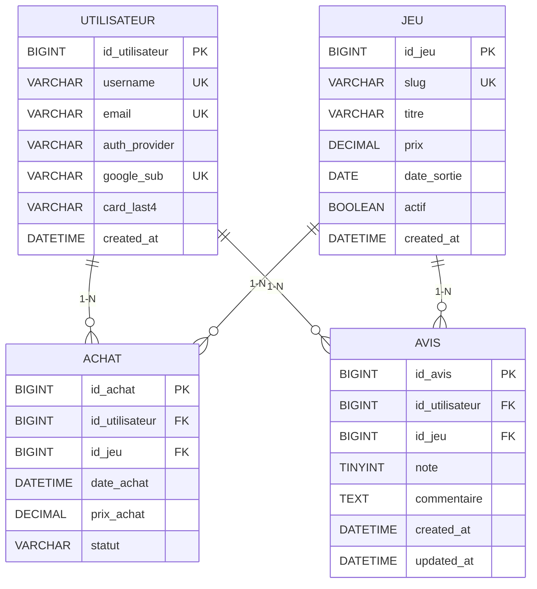

# Modeles de donnees - GameStore

Ce document propose:
- un MCD (modele conceptuel de donnees)
- un MLD (modele logique relationnel)
- des regles de gestion utiles avant implementation

Le modele est aligne avec les ecrans actuels: inscription/connexion, login Google, catalogue de jeux, achat, profil, avis.

## 1) MCD (Conceptuel)

### Entites

1. Utilisateur
- id_utilisateur (identifiant)
- username
- email
- password_hash
- auth_provider (local, google)
- google_sub
- card_last4
- created_at

2. Jeu
- id_jeu (identifiant)
- slug
- titre
- description_courte
- description_longue
- prix
- date_sortie
- image_url
- download_url
- actif
- created_at

3. Achat
- id_achat (identifiant)
- date_achat
- prix_achat
- statut (paid, refunded, cancelled)

4. Avis
- id_avis (identifiant)
- note (1..5)
- commentaire
- created_at
- updated_at

### Associations + cardinalites

1. Utilisateur effectue Achat
- Utilisateur: 0,N
- Achat: 1,1

2. Jeu est concerne par Achat
- Jeu: 0,N
- Achat: 1,1

3. Utilisateur redige Avis
- Utilisateur: 0,N
- Avis: 1,1

4. Jeu recoit Avis
- Jeu: 0,N
- Avis: 1,1

### Contraintes metier (MCD)

- Un utilisateur ne peut laisser qu'un seul avis par jeu.
- La note d'un avis est comprise entre 1 et 5.
- Un achat doit memoriser le prix au moment de l'achat (prix_achat), meme si le prix du jeu change ensuite.
- Si auth_provider = google, alors google_sub doit etre renseigne.
- Si auth_provider = local, password_hash doit etre renseigne.

### Diagramme MCD (vue simplifiee)

## 2) MLD (Logique relationnel)

### Relations

1. UTILISATEUR(
- id_utilisateur PK,
- username UQ NOT NULL,
- email UQ NULL,
- password_hash NULL,
- auth_provider NOT NULL,
- google_sub UQ NULL,
- card_last4 NULL,
- created_at NOT NULL
)

2. JEU(
- id_jeu PK,
- slug UQ NOT NULL,
- titre NOT NULL,
- description_courte NULL,
- description_longue NULL,
- prix NOT NULL,
- date_sortie NULL,
- image_url NULL,
- download_url NULL,
- actif NOT NULL,
- created_at NOT NULL
)

3. ACHAT(
- id_achat PK,
- id_utilisateur FK -> UTILISATEUR(id_utilisateur),
- id_jeu FK -> JEU(id_jeu),
- date_achat NOT NULL,
- prix_achat NOT NULL,
- statut NOT NULL
)

4. AVIS(
- id_avis PK,
- id_utilisateur FK -> UTILISATEUR(id_utilisateur),
- id_jeu FK -> JEU(id_jeu),
- note NOT NULL,
- commentaire NULL,
- created_at NOT NULL,
- updated_at NOT NULL,
- UQ(id_utilisateur, id_jeu)
)

### Normalisation

- 1NF: attributs atomiques.
- 2NF: chaque table a une cle primaire simple, pas de dependances partielles.
- 3NF: pas de dependance transitive importante dans ce perimetre.

### Diagramme MLD (vue relationnelle)

## 3) Decisions de securite recommandees

- Ne jamais stocker le numero complet de carte bancaire. Garder seulement les 4 derniers chiffres (card_last4) si necessaire.
- Stocker les mots de passe avec `password_hash()` et verifier avec `password_verify()`.
- Ajouter des index sur les cles etrangres et sur les colonnes de recherche frequente (`slug`, `username`, `email`).
